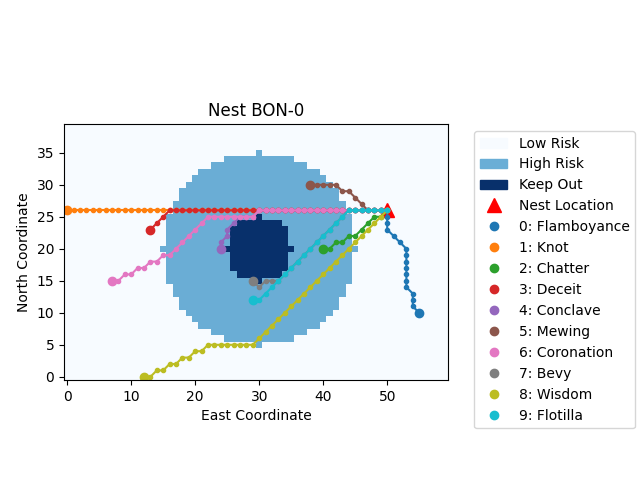
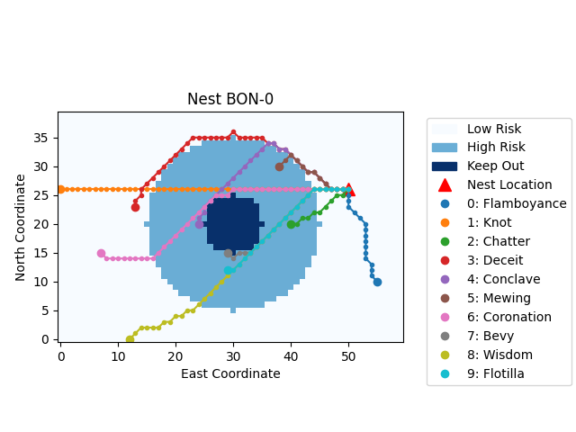
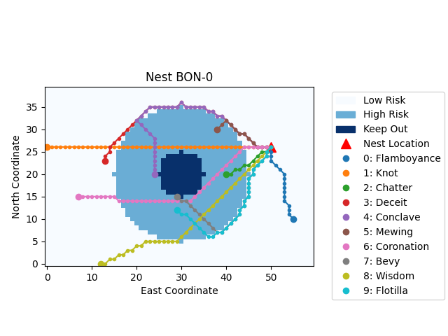

# Risk-Aware Path Planning with A-Star

## Interactive Planner

There's now an interactive planner available on [my website](https://joshuaoreilly.com/Projects/a-star-mod.html)!

## Context

An interview take-home once asked me to design a path planning algorithm that was risk-aware; essentially, the robot, operating on an 8-connected grid, had to get from a starting coordinate to a destination coordinate, balancing the number of steps it takes to reach the objective and entering into a Keep Out zone.
My Path Planning and Decision Making professor once said that A-Star (A\*) is the bread and butter of basic path planning, so I started with that and added a penalty term and weight which could be used to pull the robot out of risky areas.
The code in this repo is only my portion, and won't run without the remainder provided by the company.

## A-Star

A\* is a graph-based path planning algorithm which combines the best qualities of uniform cost search (breadth-first search with a priority queue) and greedy best-first search (depth first search with a priority queue) to find the optimal path efficiently.

Some necessary notation:

- Cost-to-reach: the total distance from the starting coordinate to the current coordinate along the best path found so far
- Cost-to-go: the distance from the current coordinate to the destination coordinate (delivery site). Since this what we're trying to find, we approximate it with an upper bound on the shortest possible distance (in our case, it's impossible for the distance to the destination to be shorter than a straight line, so we use the Euclidian distance as our heuristic cost-to-go).

The algorithm functions as follows:

### Initialization:

1. Create a priority queue which will release the coordinate with the lowest sum of cost-to-reach and cost-to-go (lowest total estimated path length)
2. Set the cost-to-reach of the starting coordinate to 0
3. Set the cost-to-go of the starting coordinate to the straight line distance (euclidian norm) between it and the destination
4. Set the parent coordinate of the starting coordinate to `None`, since it is the first coordinate

### Main Loop

The main loop of the algorithm repeats until the priority queue is empty or the destination coordinate is found, effectively signaling there is either no path to the destination, or the destination was found and further exploration isn't required.
Per iteration of the main loop:

1. Pull the coordinate with the lowest combined cost-to-reach and cost-to-go from the priority queue
2. If the coordinate is the destination, we can rebuild the path from start to finish by visiting the parent of the destination, then the parent of that coordinate, and so forth until we reach the starting coordinate
3. If the coordinate is not the destination, find all valid neighboring coordinates (neighbors within the bounds of the risk map and outside the Keep Out zone), and per neighbor:
    1. Calculate the new cost-to-reach of the neighbor as the cost-to-reach of the current coordinate, plus the cost to get from the current coordinate to the neighbor (`1` or `sqrt(2)` for an 8-connected grid)
    2. If either a) the neighbor hasn't been visited before or b) the new cost-to-reach is smaller than its previous cost-to-reach (indicating we found a more efficient path to it), then:
        1. Set the neighbor's cost-to-reach as the newly calculated one
        2. Set the neighbor's parent coordinate as the current coordinate
        3. Add the neighbor to the priority queue for further exploration, with its priority equal to its cost-to-reach plus its cost-to-go

## Risk-Aware A-Star

A\* finds an optimal path to a given destination, but does not natively account for a maximum acceptable path length, nor high risk zone that we wish to avoid.

To solve the former, an additional condition is added to step 3.2 above: the sum of the cost-to-reach and cost-to-go (so lower bound on the total path length) must not exceed the maximum acceptable path length.

To account for minimizing the total risk, I've added a second cost-to-reach, called cost-to-reach-penalty, which sums up the total distance between the start coordinate and the current coordinate, as well as the total penalty accumulated for traversing the High Risk zone, multiplied by a weighing factor (`HIGH_RISK_PENALTY`).
cost-to-reach-penalty is then used everywhere that the cost-to-reach would be used in the regular algorithm.
In step 3.2, this means we only consider the path to a coordinate as improved if the sum of the new cost-to-reach and the accumulated penalty is lower.
In step 1, the coordinate with the lowest sum of cost-to-reach and penalty is pulled first.

This approach is flexible, in that we can tune the `HIGH_RISK_PENALTY` to prioritize a shorter path or lesser risk.
For example, `HIGH_RISK_PENALTY=0` is effectively the same as the original A\* algorithm and gives the shortest path possible, without regard for total risk.

`HIGH_RISK_PENALTY=13` or higher will maximally prioritize minimizing risk, and will give routes which give the lowest possible risk, while keeping the path length under or equal to the maximum.

Finally, `0 < HIGH_RISK_PENALTY < 13` can be used to give more or less emphasis to path length or risk management.

Penalty of 0.2.

Penalty of 0.4.

Penalty of 1.0.

Penalty of 10.0.
